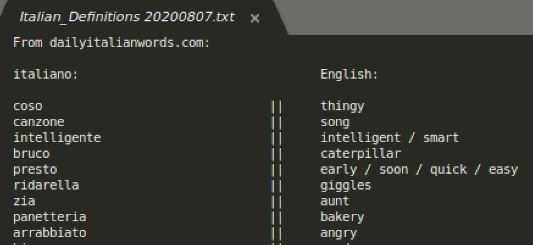

# Raschi

A lightweight webscraper used to build an .txt quick reference Italian-English dictionary based on dailyitalianwords.com

##### Important Notes
* This was built for infrequent, manual use.

* 'raschi_with_comments.rb' and 'raschi_without_comments.rb' both run the program as expected.

##### Example Output

